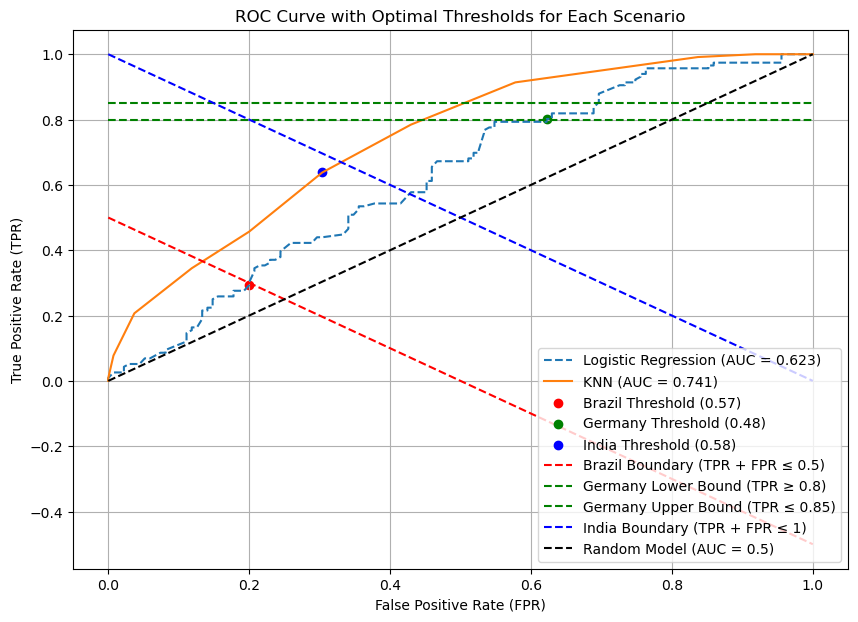
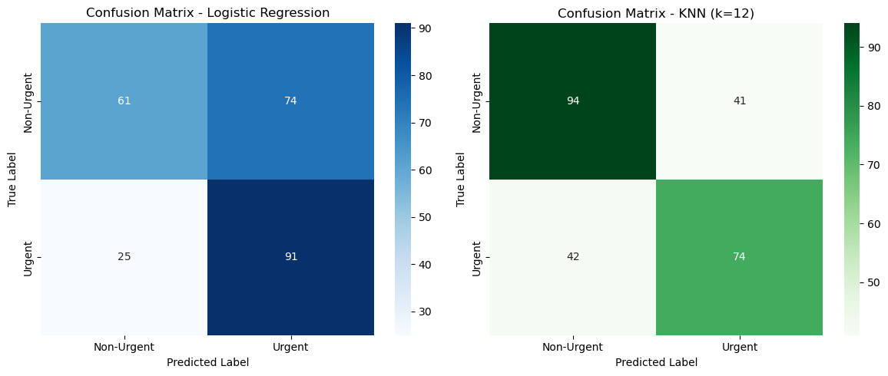

# Predicting COVID-19 Urgency for Hospital Admission

## Project Overview
This project is part of **Harvard University's CS109x Introduction to Data Science with Python** course, available on the **edX platform**.

The goal is to predict the **urgency of hospital admission** for COVID-19 patients based on their symptoms and demographics. This study explores how machine learning can assist policymakers in **optimizing healthcare resources** while addressing country-specific constraints.

---

## Dataset
The dataset includes patient records with the following features:
- **Demographics**: Age, Sex  
- **Symptoms**: Cough, Fever, Chills, Sore Throat, Headache, Fatigue  
- **Target Variable**: `Urgency` (1 = Urgent, 0 = Non-Urgent)

---

## Models Used
We tested two classification models:
1. **Logistic Regression**
2. **K-Nearest Neighbors (KNN)**

Each model was optimized using **GridSearchCV** to find the best hyperparameters.

---

## Performance Metrics
We evaluated the models using multiple metrics to get a well-rounded view of their performance:
- **Accuracy**: Overall correctness of the model  
- **Sensitivity (Recall)**: Ability to detect urgent cases  
- **Specificity**: Ability to correctly classify non-urgent cases  
- **Precision**: How many predicted urgent cases were actually urgent  
- **F1 Score**: Balance between precision and recall  
- **AUC-ROC Curve**: Measures how well the model distinguishes between classes  

### Final Performance Table

| **Metric**             | **Logistic Regression** | **KNN (k=12)**  |
|------------------------|----------------------|----------------|
| Accuracy              | 60.6%                | **66.9%**      |
| Sensitivity (Recall)  | **78.4%**            | 63.8%          |
| Specificity           | **54.8%**            | 30.4%          |
| Precision             | 55.2%                | **64.3%**      |
| F1 Score             | **64.8%**            | 64.1%          |
| AUC-ROC              | 0.623                | **0.739**      |

---

## Choosing the Best Model for Different Countries
Since different countries had different policy goals, we selected the best model for each based on **specific constraints**:

### Brazil (Avoid Overclassification of Urgent Cases)
- Officials wanted to **limit the number of urgent cases classified** to avoid political backlash.
- **Criteria:** TPR + FPR ≤ 0.5
- **Best Model:** Logistic Regression
- **Optimal Threshold:** 0.50

### Germany (Maximize Identification of Urgent Cases)
- The goal was to **detect as many urgent cases as possible** to minimize fatalities.
- **Criteria:** 0.8 ≤ TPR ≤ 0.85
- **Best Model:** Logistic Regression
- **Optimal Threshold:** 0.42

### India (Hospital Bed Crisis, Avoid False Positives)
- Due to **severe hospital bed shortages**, the government wanted to ensure **only the most critical patients were classified as urgent**.
- **Criteria:** TPR + FPR ≤ 1
- **Best Model:** KNN (k=12)
- **Optimal Threshold:** 0.37

---

## Key Visuals
### ROC Curve with Policy Constraints
This graph shows how different models perform, along with decision boundaries based on the constraints of each country.



### Confusion Matrices
These visualizations show how each model classifies urgent vs. non-urgent cases.



---

## Key Takeaways
- **Model selection depends on the real-world context.** The "best" model isn't always the most accurate one—different countries have different priorities.
- **Adjusting the classification threshold** is just as important as choosing the right model. A well-placed decision boundary can significantly impact policy outcomes.
- **KNN performed better overall**, but Logistic Regression was more reliable for cases where recall (sensitivity) was a priority.

---

## How to Use This Repository
1. **Clone the repository**
   ```bash
   git clone https://github.com/your-username/covid-urgency-prediction.git
   cd covid-urgency-prediction
   ```
2. **Install required packages**
   ```bash
   pip install -r requirements.txt
   ```
3. **Run the analysis in Jupyter Notebook**
   ```bash
   jupyter notebook
   ```

---

## Next Steps & Future Work
- **Test more advanced models** like **Random Forest** and **XGBoost** to see if we can improve accuracy and specificity.
- **Include more medical indicators** (e.g., oxygen levels, pre-existing conditions) to refine predictions.
- **Deploy the model** via an API for real-time predictions.

---

## Contributors
**Almira Sozlu** – *Senior Data Analyst*  
📫 Feel free to connect on [LinkedIn](https://www.linkedin.com/in/elif-almira-sozlu/)

